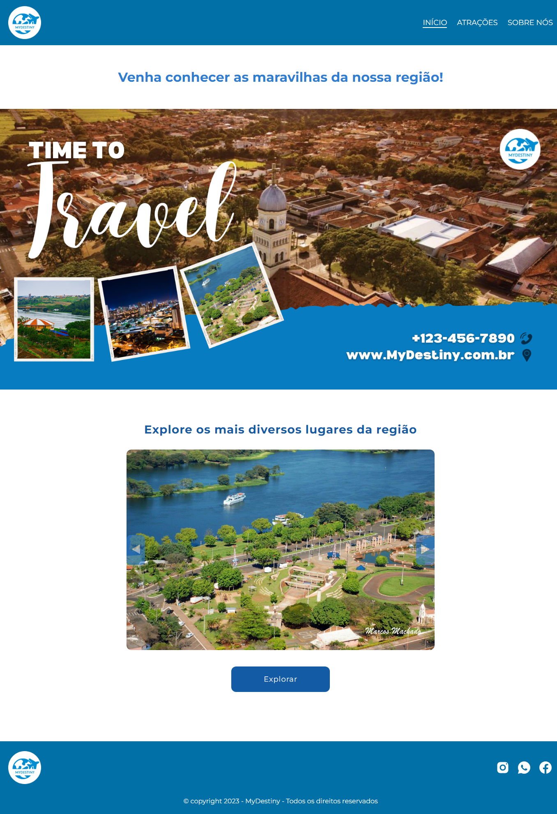
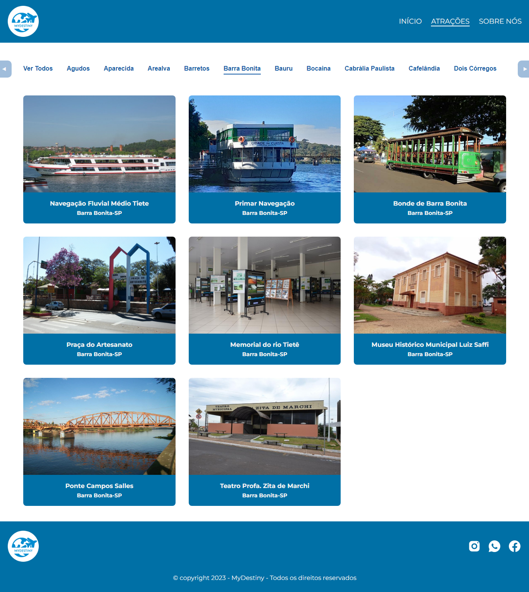
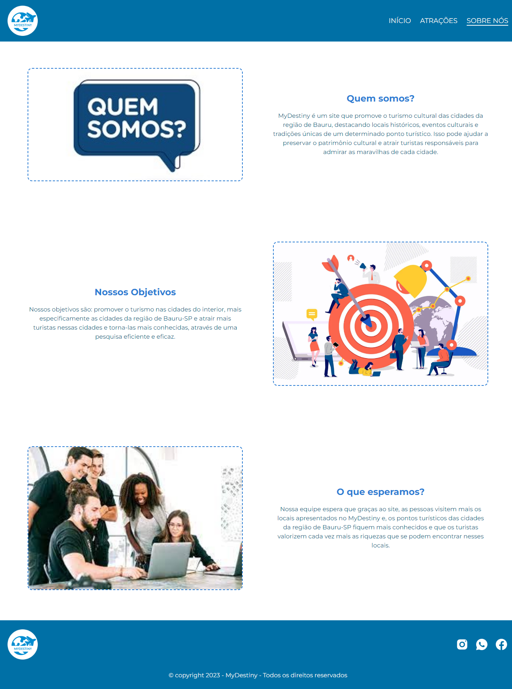

<h1 align="center">🧳 MyDestiny 🧳</h1>

<p align="center">
  
</p>


<h3 align="justify">Projeto final (em grupo) da disciplina Laboratório de Mediação e Intervenção Sociocultural - Professor: Celso Faustino da Silva Junior, 2º ano do Ensino Médio com Habilitação Profissional de Técnico em Informática para Internet - ETEC Comendador João Rays - 4º Bimestre.<h3>

<br>

## Tópicos
- [Algumas telas do projeto](#telas)
- [Executando o projeto](#execute)
- [Descrição](#desc)
- [Tecnologias utilizadas](#tec)
- [Status do projeto](#status)  
- [Desenvolvedores do projeto](#devs)
- [Licença](#license)

<br>

<h2 id="telas">🖼 Algumas telas do projeto</h2>

<h3>Home</h3>

<p align="left">
  
</p>

<br>

<h3>Atrações</h3>

<p align="left">
  
</p>

<br>

<h3>Sobre nós</h3>

<p align="left">
  
</p>

<br>

<h2 id="execute">📋 Executando projeto</h2>

<h3>Pré-requisito</h3>

- [.NET 6.0](https://dotnet.microsoft.com/pt-br/download/dotnet/thank-you/sdk-6.0.417-windows-x64-installer)

<h3>Passo a passo</h3>

```bash
# Clone este repositório
$ git clone https://github.com/Fel1324/MyDestiny.git

# Acesse a pasta do projeto no terminal/cmd
$ cd MyDestiny

# Com o .NET instalado execute os seguintes comandos
$ dotnet restore
$ dotnet clean
$ cd MyDestiny

# Por fim, para iniciar o projeto execute o comando abaixo
$ dotnet run

O servidor irá iniciar em -> https://localhost:7007
```

<br>

<h2 id="desc">💾 Descrição</h2>

<p align="justify">
    MyDestiny é um site que exibe alguns dos principais pontos turísticos mais atrativos da região de Bauru-SP e algumas atrações turísticas presentes no interior de São Paulo. 
</p>

<br>

<h2 id="tec">🚀 Tecnologias utilizadas</h2>

* CSHTML e CSS
* Javascript
* Git e Github
* C# e .NET

<br>

<h2 id="status">🚧 Status dos projetos</h2>

✔️ Projeto Finalizado

<br>

<h2 id="devs">👨‍💻 Desenvolvedores do projeto</h2>

* Rafael Roberto de Oliveira
* Matheus Nunes Bertolini
* José Francisco dos Santos Neto
* Rafael Haziel Silva Buss

<br>

<h2 id="license">📝 Licença</h2>

O projeto está sob a licença MIT.
